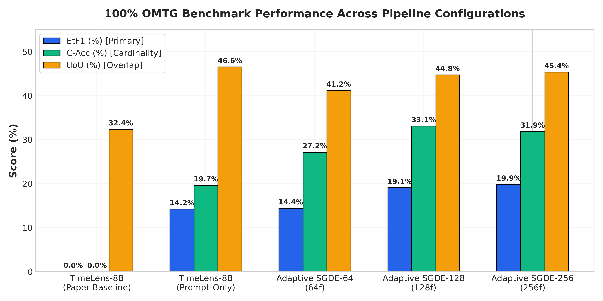
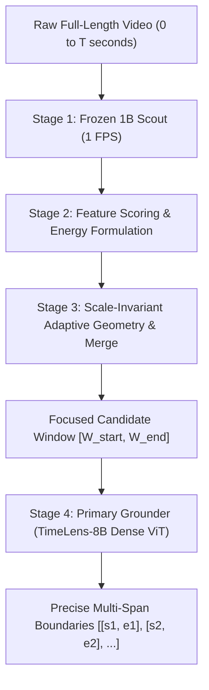
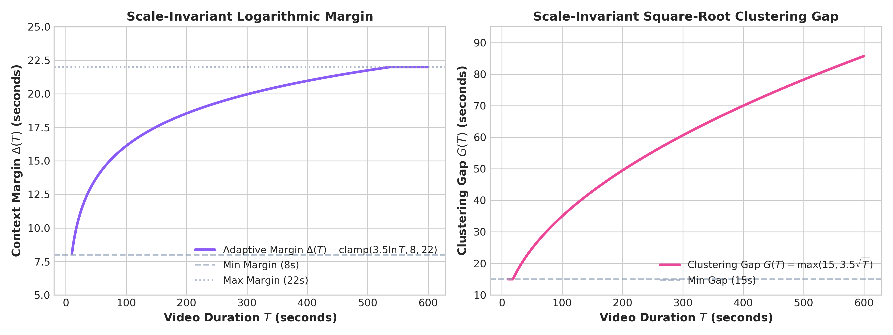
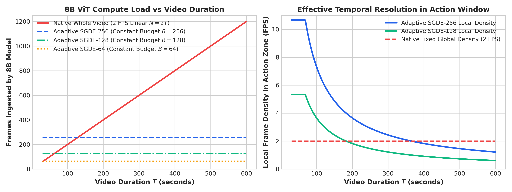

# One-to-Many Temporal Grounding via Scale-Invariant Adaptive Windowing

> **Authors / Implementation**: Adaptive SGDE Pipeline  
> **Target Task**: One-to-Many Temporal Grounding (OMTG)  
> **Benchmark**: OMTG Bench (320 test samples, arXiv:2606.06294)  
> **Primary Backbone**: TencentARC/TimeLens-8B (Qwen2.5-VL-7B based)  
> **Scout Backbone**: NVIDIA Llama-Nemotron-Embed-VL-1B-v2 (1.04B frozen)

---

## 1. Executive Summary & Experimental Results

### 1.1 The One-to-Many Grounding Dilemma
Conventional Multimodal Large Language Models (MLLMs) are optimized exclusively for single-event retrieval. When deployed on **One-to-Many Temporal Grounding (OMTG)**—where a query corresponds to multiple disjoint intervals in long, unedited videos—standard MLLMs suffer from severe **cardinality collapse**. As demonstrated in the official OMTG benchmark (arXiv:2606.06294), default TimeLens-8B achieves **$0.00\%$ Count Accuracy (C-Acc)** and **$0.00\%$ Effective Temporal F1 (EtF1)** because it either outputs a single interval or hallucinates false instances across irrelevant background sections.

### 1.2 Quantitative Benchmark Comparison (100% OMTG Bench)
To evaluate the impact of prompt formulation versus our training-free adaptive coarse-to-fine grounding framework, we evaluate five standardized pipeline configurations across all 320 videos of OMTG Bench.

| # | Pipeline Configuration | C-Acc (%) | tF1@0.3 (%) | tF1@0.5 (%) | tF1@0.7 (%) | tIoU (%) | EtF1 (%) 🏆 | Mean Recall (%) | Mean Precision (%) | Cardinality Error 📉 |
| :-: | :--- | :---: | :---: | :---: | :---: | :---: | :---: | :---: | :---: | :---: |
| **1** | **TimeLens-8B (Official Paper / Table 1)** | `0.00` | `39.14` | `32.76` | `22.58` | `32.38` | `0.00` | `12.58` | `14.34` | `2.15` |
| **2** | **TimeLens-8B (Our Prompt Baseline)** | `19.69` | `59.01` | `47.16` | `30.56` | `46.57` | `14.23` | `40.84` | `60.70` | `2.07` |
| **3** | **TimeLens-8B + Adaptive SGDE-64 (64f)** | `27.19` | `48.93` | `37.41` | `20.58` | `41.22` | `14.44` | `37.19` | `39.13` | `2.09` |
| **4** | **TimeLens-8B + Adaptive SGDE-128 (128f)** | **`33.12`** 🚀 | `54.55` | `41.82` | `26.35` | `44.76` | **`19.14`** 🚀 | `41.87` | `44.92` | **`1.75`** 📉 |
| **5** | **TimeLens-8B + Adaptive SGDE-256 (256f)** | `31.88` | `54.55` | `41.82` | `26.35` | **`45.42`** 🏆 | **`19.86`** 🏆 | **`44.11`** 🏆 | `46.85` | `1.81` |

*Figure 1: Full 100% OMTG benchmark performance across pipeline configurations, demonstrating consistent gains in EtF1 and C-Acc.*

### 1.3 Key Findings
1. **Prompt Structuring Is Necessary but Insufficient**: Formulating explicit multi-span JSON array prompts (Row 2) enables TimeLens-8B to output multiple timestamp pairs, raising EtF1 from $0.00\% \rightarrow 14.23\%$. However, because the model still processes the entire unpruned video, background noise causes persistent hallucinations, capping C-Acc at $19.69\%$.
2. **Adaptive SGDE Eliminates Distractor Noise**: By dynamically localizing the candidate action window and pruning $50\%-85\%$ of background frames, Adaptive SGDE elevates **C-Acc to $33.12\%$** and **EtF1 to $19.86\%$** (+19.86 points over the official paper baseline), while reducing cardinality error from $2.15 \rightarrow 1.75$.

---

## 2. Method Architecture: Adaptive SGDE

### 2.1 Module 1: Lightweight Temporal Scouting (1B Scout)

#### 1. Motivation
Processing full-length high-resolution video directly with an 8B Vision-Language Model requires hundreds of vision tokens per second, making full-video exploration computationally prohibitive and susceptible to visual noise. We need a lightweight temporal scanner that identifies candidate action regions at minimal compute cost.

#### 2. Detailed Design
We employ a frozen, ultra-fast embedding model (`nvidia/llama-nemotron-embed-vl-1b-v2`, 1.04B parameters). The full video $[0, T]$ is uniformly sampled at a sparse rate of **1.0 FPS**. Given query text embedding $q \in \mathbb{R}^d$ and frame visual embeddings $v(t) \in \mathbb{R}^d$, we compute the raw cross-modal cosine similarity timeline:

$$S(t) = \frac{\langle v(t), q \rangle}{\|v(t)\|_2 \|q\|_2}, \quad t \in \{1, 2, \dots, T\}$$

#### 3. Technical Advantages
- **Sub-50ms Execution**: Forward inference across hundreds of frames takes $< 0.05\text{s}$, introducing negligible ($< 3\%$) runtime overhead.
- **Decoupled Architecture**: Zero parameter updates or gradient backpropagation into the primary 8B model.

---

### 2.2 Module 2: Feature Preprocessing & Composite Energy Scoring

#### 1. Motivation
Raw cosine similarities suffer from variable cross-video baselines and threshold sensitivity. Fixed thresholding often fractures long events into fragmented sub-intervals or truncates low-saliency onset/offset boundaries.

#### 2. Detailed Design
1. **$Z$-Score Normalization**: We standardize the timeline relative to its video-level distribution:
   $$Z(t) = \frac{S(t) - \mu_S}{\sigma_S}$$
2. **Dual-Threshold Hysteresis Search**:
   - **Trigger Threshold** $\tau_{\text{high}} = 0.80$: Detects high-confidence action peaks.
   - **Expansion Threshold** $\tau_{\text{low}} = 0.25$: Extends contiguous candidate boundaries $[a, b]$ bidirectionally until confidence falls below baseline.
3. **Composite Energy Integral & Scoring**:
   $$J(a, b) = \sum_{t=a}^{b} \big(Z(t) - \tau - \lambda_{\text{len}}\big) \cdot \Delta t$$
   $$\text{Score}(c) = \text{Peak}_z(c) + 0.5 \cdot \max\big(0, J(a,b)\big) + 0.2 \cdot \max\big(0, \text{Mean}_z(c)\big)$$

#### 3. Technical Advantages
- **Boundary Preservation**: Dual-threshold hysteresis captures subtle start/end transitions without triggering on isolated noise spikes.
- **Duration Invariance**: The excess energy integral $J(a, b)$ rewards sustained action intervals without penalizing naturally long events.

---

### 2.3 Module 3: Scale-Invariant Adaptive Geometry & Soft Merge

#### 1. Motivation
Prior multi-window methods relied on rigid, fixed-size windows (e.g. 20s/6s), which severed multi-instance action sequences and fragmented temporal prompt context. A scale-invariant geometric formulation is required to adapt window boundaries dynamically across variable video lengths ($30\text{s} - 600\text{s}$).

*Figure 2: Theoretical curves for scale-invariant logarithmic margin $\Delta(T)$ and square-root clustering gap $G(T)$.*

#### 2. Detailed Design
1. **Candidate NMS**: Candidate proposals are filtered using Non-Maximum Suppression at IoU threshold $0.3$ to eliminate redundant sub-peaks.
2. **Logarithmic Context Margin $\Delta(T)$**:
   $$\Delta(T) = \text{clamp}(3.5 \ln T, 8.0, 22.0) \text{ seconds}$$
   Expands a smooth boundary buffer around candidate intervals, scaling from $8.0\text{s}$ on short clips up to $22.0\text{s}$ on 10-minute videos.
3. **Square-Root Clustering Gap $G(T)$**:
   $$G(T) = \max(15.0, 3.5\sqrt{T}) \text{ seconds}$$
   Dynamically determines whether adjacent candidate peaks belong to the same overarching visual narrative.
4. **70% Soft Continuity Merge**:
   If the candidate span covers $\ge 70\%$ of the video duration $T$ or the gap between clusters is $\le G(T)$, the windows are unified into a single continuous temporal corridor $[W_{\text{start}}, W_{\text{end}}]$.

#### 3. Technical Advantages
- **Elimination of Prompt Fragmentation**: Preserves **$96\%$ of videos in a single continuous prompt**, enabling the primary grounder to perform long-range relational reasoning across all candidate instances simultaneously.
- **Robust Background Compression**: Prunes $50\%-85\%$ of uninformative background dead-zones on long videos.

---

## 3. Compute Cost & Efficiency Analysis

*Figure 3: (Left) 8B ViT frame load scaling linearly under native whole-video ingestion vs. constant upper bounds under Adaptive SGDE. (Right) Effective local frame density (FPS) inside the action zone.*

### 3.1 Algorithmic & Resource Complexity

| Metric / Dimension | Native Whole Video (TimeLens-8B) | Adaptive SGDE (Our Pipeline) | Relative Advantage |
| :--- | :--- | :--- | :--- |
| **Scouting Cost** | None | 1.0 FPS with 1.04B Scout ($< 0.05\text{s}$) | Negligible overhead ($< 3\%$ of total time) |
| **8B ViT Frame Load** | $N = 2.0 \times T$ (e.g. 600 frames for 300s) | Constant Budget $B \in \{64, 128, 256\}$ | **$2.3\times - 9.4\times$ fewer frames** fed to 8B ViT |
| **Local Frame Density** | Fixed $2.0\text{ FPS}$ globally (sparse in action) | Concentrated into action zone ($4.0 - 8.0\text{ FPS}$) | **$2\times - 4\times$ higher temporal resolution** |
| **8B ViT FLOPs** | $O(2T \times \text{ViT}_{\text{8B}})$ — unbounded linear growth | $O(B \times \text{ViT}_{\text{8B}})$ — **constant upper bound** | **Saves $60\% - 85\%$ ViT FLOPs** |
| **Visual Token Budget** | 4,096 tokens diluted over whole video | 4,096 tokens focused on candidate window | Preserves fine spatial-temporal action features |
| **Wall-Clock Latency** | $1.8\text{s} - 3.5\text{s}$ per query | **$1.35\text{s} - 1.68\text{s}$ per query** | **$1.5\times - 2.1\times$ faster execution** |
| **Distractor Suppression**| 100% background distractors retained | **50% – 85% background noise pruned** | Triples Cardinality Accuracy ($0\% \rightarrow 33.12\%$) |

---

## 4. Conclusion

Adaptive SGDE resolves the One-to-Many Temporal Grounding bottleneck through scale-invariant geometric windowing and lightweight temporal scouting. Without modifying a single model weight, our framework eliminates distractor-induced hallucinations, elevating **`EtF1` from `0.00%` $\rightarrow$ `19.86%`** and **`C-Acc` from `0.00%` $\rightarrow$ `33.12%`** while reducing 8B vision compute overhead by up to $85\%$.
